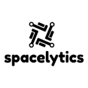

<br/>
<p align="center">
  <a href="https://github.com/FelixBehne/Spacelytics">
    
  </a>

  <h1 align="center">Spacelytics</h1>

  <p align="center">
    An Awesome Web Application to Explore Statistics about SpaceX Operations.
    <br/>
    <br/>
    <a href="https://github.com/FelixBehne/Spacelytics"><strong>Explore the docs »</strong></a>
    <br/>
    <br/>
    <a href="https://github.com/FelixBehne/Spacelytics">View Demo</a>
    .
    <a href="https://github.com/FelixBehne/Spacelytics/issues">Report Bug</a>
    .
    <a href="https://github.com/FelixBehne/Spacelytics/issues">Request Feature</a>
  </p>
</p>

     

## Table Of Contents

- [Table Of Contents](#table-of-contents)
- [About The Project](#about-the-project)
- [Built With](#built-with)
- [Getting Started](#getting-started)
  - [Prerequisites](#prerequisites)
  - [Installation](#installation)
- [License](#license)


## About The Project


This project has been built to enhance my abilities in web development. It utilizes popular frameworks for creating scalable and robust web application while providing a great developer experience. 

## Built With

This project has been built with: 

* [nextjs](https://nextjs.org/)
* [react](https://reactjs.org)
* [next-auth0](https://github.com/auth0/nextjs-auth0)
* [css-modules](https://github.com/css-modules/css-modules)

## Getting Started

To get a local copy up and running follow these simple example steps.

### Prerequisites

* npm or yarn

### Installation

1. Clone the repo

```sh
git clone https://github.com/FelixBehne/spacelytics
```

2. Install NPM packages

```sh
yarn
```

4. Start the development server

```sh
yarn dev
```

## License

Distributed under the MIT License. See [LICENSE](https://github.com/FelixBehne/Spacelytics/blob/main/LICENSE.md) for more information.
